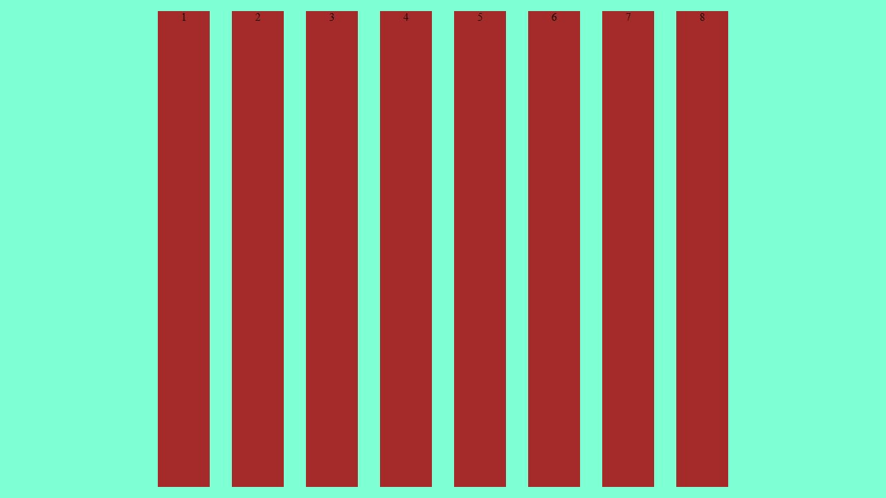
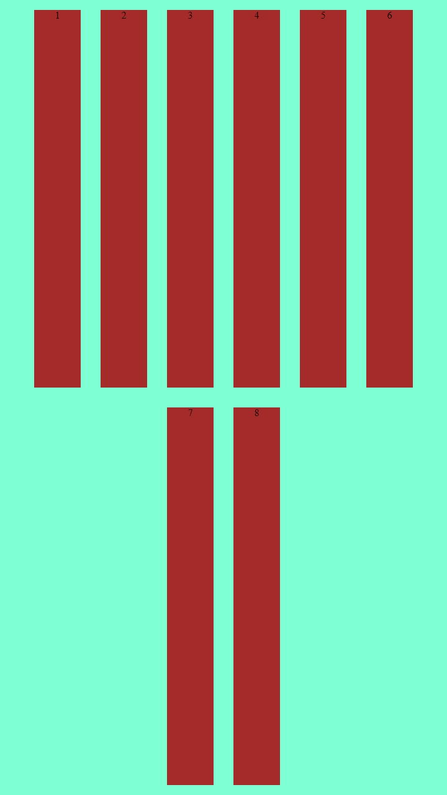
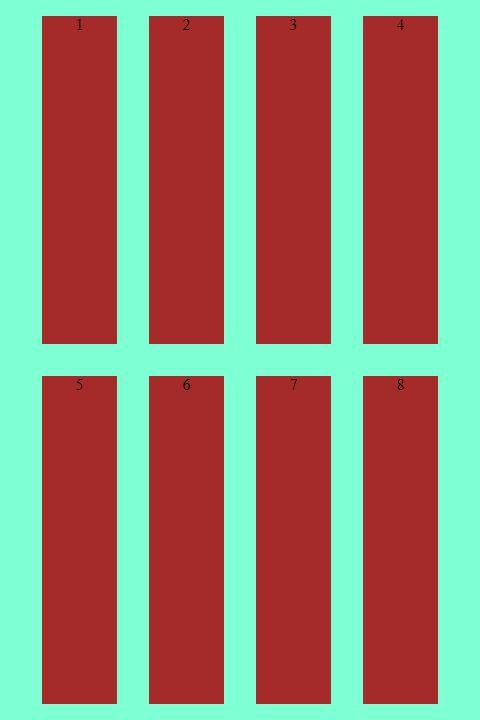

# Node-Screenshot

A node script that automatically generates screenshots of responsive HTML elements. Useful for creating set of images for social media banners and the like, which recommend images with different dimensions.

## Installation

```
npm install
```

## How to use

1. Create your responsive design in a `div` element in your HTML document and give it a unique ID.
2. Set the HTML path, `div` container ID, preferred format, and output directory in lines 4-8 of `index.js`.
3. Set the width and height of the images in the 2nd and 3rd column in `sizes.csv`, and each image filename prefix in the third column.
4. Run the following command:

```
node index.js
```

Your images will be created in the `images/` directory.

## Example



